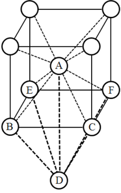

.. _defect_chapter:

点欠陥の生成エネルギーの計算
============================

PHASE/0による構造最適化計算や原子・分子の計算などを組み合わせることによって様々な生成エネルギーの計算を計算することが可能です。ここでは，体心立方バナジウムの点欠陥を例にPHASE/0を利用して生成エネルギーを計算します。サンプルデータは ``wsl/V`` 以下にあります。なお，この例題の入力設定は計算負荷を下げるため荒い\ **k**\ 点サンプリングを採用し，また電子数の少ない非推奨の擬ポテンシャルを用いています。そのため得られる結果そのものは信頼できるものではありません。計算手順を理解していただくことが目的の例題です。

Self-interstitialの生成エネルギー
--------------------------------------------

母体の結晶と同じ原子種の元素が格子間に入り込む欠陥がself-interstitial欠陥です。入り込む位置の候補として，体心立方格子の場合tetrahedral位置とoctahedral位置が考えられます。tetrahedral位置とは :numref:`defect_bcc_site` の原子ABCDが作る四面体の中心位置であり，たとえば(0.5, 0.25, 0.0)の位置です。体心立方格子におけるoctahedral位置とは右の図の原子ABCDEFが作る八面体の中心位置であり，たとえば(0.5,0.5,0.0)の位置です。Interstitialのほか，単純に格子位置に原子が存在しない空孔欠陥などもサンプルデータとしては用意しています。

  体心立方格子のサイト

.. _入力データの確認-9:

入力データの確認
~~~~~~~~~~~~~~~~

この例題の入力ファイルは ``wsl/V/self`` 以下のサブディレクトリーの下に配置されています。各入力パラメーターファイルは，原子座標データの欠陥が導入されていること以外は特別な点はありません。構造最適化は必須であり，すべての原子が最適化の対象となるような設定が施されています。典型的には以下のような内容です。

.. code-block:: text

  structure{
    atom_list{
      atoms{
      #units angstrom
      #tag element rx ry rz mobile
        V -0.0283241509 -0.0283241509 0.00 1
        ...
      }
    }
    element_list{
      #tag element atomicnumber mass zeta deviation
        V 23 92860.1055 0.0 1.83
    }
    symmetry{
      method = automatic
    }
    ...
  }
  accuracy{
    cutoff_wf = 25 Rydberg
    cutoff_cd = 225 Rydberg
    ksampling{
      mesh{
        nx = 2
        ny = 2
        nz = 2
      }
    }
  }

また，参照用の欠陥のないスーパーセルの入力ファイルは ``wsl/V/ref/V`` 以下にあります。

.. _計算の実行-9:

計算の実行
~~~~~~~~~~

これまでと同じように計算を実行します。ただ，この例題は計算時間短縮のため\ **k**\ 点サンプリングを粗くとっているため1点しか\ **k**\ 点がない場合も多いです（対称性に依存します）特に引数をつけずに実行すると可能な場合は\ **k**\ 点並列を併用し，そうでない場合はバンド並列のみで計算が実行されるので引数を渡さずに実行すると効率がよいかもしれません。

.. parsed-literal::

  mpirun -n 2 $HOME/|PHASE020XX.yy|/bin/phase

.. _結果の解析-4:

結果の解析
~~~~~~~~~~

Self-interstitialの生成エネルギーは以下のように評価することができます。

.. math:: E_{\text{f}} = E_{\text{tot}}\left( \text{Crystal} + \text{point defect} \right) - N_{\text{atom}}E_{\text{tot}}\left( \text{Crystal} \right)

ここで\ :math:`E_{\text{tot}}\left( \text{Crystal} \right)`\ は結晶の原子1個当たりの全エネルギー，\ :math:`E_{\text{tot}}\left( \text{Crystal} + \text{point defect} \right)`\ は点欠陥を含むスーパーセルの全エネルギーです。結晶のエネルギーは，\ **k**\ 点サンプリングが十分なら基本格子のエネルギーから算出することもできますが，欠陥のスーパーセルと同じ大きさの系を採用する方が無難です。本例題ではrefディレクトリーに欠陥のないスーパーセルの入力データが用意されているのでその結果を用います。

全エネルギーの計算結果はnfefn.dataファイルの最後の行に記録されます。たとえば，tetrahedral欠陥の場合エネルギーの計算値は-110.4633242498 hartree, 欠陥のないスーパーセルの全エネルギーは-104.0740790123 hartreeなので，欠陥生成エネルギーは\ :math:`- 110.4633242498 - 17 \times \left( \frac{- 104.0740790123}{16} \right) \approx 0.1154\ \text{hartree}`

となります。eV単位にすると3.14 eV程度となります。

Impurity interstitialの生成エネルギー
-------------------------------------

母体の結晶とは異なる原子種の元素が格子間に入り込む欠陥がimpurity interstitial欠陥です。この場合も入り込む位置はtetrahedral位置，octahedral位置が考えられます。母体の結晶の原子と入れ替わるsubstitutional欠陥も考えられます。

.. _入力データの確認-10:

入力データの確認
~~~~~~~~~~~~~~~~

この例題の入力ファイルには，原子座標データの欠陥が導入されていること以外は特別な点はありません。構造最適化は必須であり，すべての原子が最適化の対象となるような設定が施されています。

この例題では異種元素はヘリウム原子を想定しています。そこで，生成エネルギーを求めるためにヘリウム原子の計算を行う必要があります。原子の計算は十分大きな単位胞に孤立した原子を1個置くことによって行うことができます。この際，\ **k**\ 点サンプリングはΓ点のみとします。カットオフエネルギーは他の計算のそれと同じ値を採用するようにしてください。具体的には下記のような内容になります。

.. code-block:: text

  accuracy{
    ksampling{
      method = gamma
    }
    cutoff_wf = 25 Rydberg
    cutoff_cd = 225 Rydberg
    ...
  }
  structure{
    atom_list{
      atoms{
        #units angstrom
        #tag element rx ry rz mobile
        He 0.0 0.0 0.0 1
      }
    }
    ...
    unit_cell{
      #units angstrom
      a_vector = 15 0.00 0.00
      b_vector = 0.00 15 0.00
      c_vector = 0.00 0.00 15
    }
    symmetry{
      method = automatic
    }
  }

.. _計算の実行-10:

計算の実行
~~~~~~~~~~

計算の実行もself-interstitialの場合と全く同じ要領で行うことができます。

.. _結果の解析-5:

結果の解析
~~~~~~~~~~

Impurity-interstitialの生成エネルギーは以下のように評価することができます。

.. math:: E_{\text{f}} = E_{\text{tot}}\left( \text{Crystal} + \text{point defect} \right) - \left( N_{\text{atom}} - 1 \right)E_{\text{tot}}\left( \text{Crystal} \right) - E_{\text{tot}}(\text{atom})

ここで\ :math:`E_{\text{tot}}\left( \text{Crystal} \right)`\ は結晶の原子1個当たりの全エネルギー，\ :math:`E_{\text{tot}}\left( \text{Crystal} + \text{point defect} \right)`\ は点欠陥を含むスーパーセルの全エネルギー，\ :math:`E_{\text{tot}}(\text{atom})`\ は原子1個の全エネルギーです。

たとえば，tetrahedral位置にヘリウム原子が入り込んだ系の全エネルギーは-106.8410461476 hartree 結晶のスーパーセルの全エネルギーは前節でも言及したように -104.0740790123 hartreeヘリウム原子の全エネルギーは-2.8627340281 hartreeなので欠陥生成エネルギーは

.. math:: - 106.8410461476 - \left( 17 - 1 \right) \times \left( \frac{- 104.0740790123}{16} \right) - ( - 2.8627340281) \approx 0.0958\ \text{hartree}

となります。eV単位に変換すると2.61 eV程度です。

