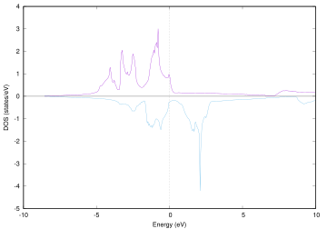
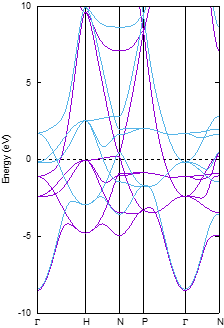

.. _mag_chapter:

磁性を考慮した計算
==================

前章では非磁性の計算を行いましたが，磁性を考慮した計算を行うことも可能です。ここでは体心立方格子の鉄結晶を例に，磁性を考慮した計算を行う方法を紹介します。例題の入力ファイルは ``wsl/Fe`` 以下に配置されています。計算の流れはシリコン結晶の場合と同様で，SCF計算を行い，結果得られた電荷密度を入力としてバンド構造や状態密度の計算を行います。同様の手続きで\ *EV*\ 曲線の計算なども行うことができます。

.. _scf計算-1:

SCF計算
-------

磁性を考慮する場合も基本となるのはSCF計算です。例題の入力ファイルは ``wsl/Fe/scf`` の下にあります。

.. _入力データの確認-6:

入力データの確認
~~~~~~~~~~~~~~~~

SCF計算の入力の内容は下記の通り(前章と同じ部分は一部省略)

.. code-block:: text

  accuracy{
    ksampling{
      mesh{ nx = 10, ny = 10, nz = 10 }
    }
  }
  structure{
    unit_cell{
      #units angstrom
      a = 2.845, b = 2.845, c = 2.845
      alpha = 90, beta = 90, gamma = 90
    }
    symmetry{
      method = automatic
      tspace{
        lattice_system = bodycentered
      }
    }
    magnetic_state = ferro
    atom_list{
      atoms{
        #tag rx ry rz element
        0.000 0.000 0.000 Fe
      }
    }
    element_list{
      #tag element atomicnumber zeta
      Fe 26 0.275
    }
  }

-  原子配置の与え方としてBravais格子を与える方法を採用しています。単位胞としては体心立方格子の基本格子ではなく立方格子のそれをあたえ，体心立方格子であることはsymmetryのtspaceブロックにおけるlattice_system = bodycenteredで指定しています。このように指定すると，プログラムは格子ベクトルを自動的に基本格子のそれに変換します。原子座標の指定もそれに合わせ，原点のみの指定となっています。
-  structureブロックのmagnetic_stateにferroを指定しています。このキーワードはややミスリーディングですが，強磁性体に限られるわけではなく，スピンを考慮した計算を行う，という設定です。
-  element_listにおいてzetaの値を指定しています。zetaは“初期スピン分極”の設定です。スピン分極\ :math:`\zeta`\ とは，アップスピンの電子数を\ :math:`n_{\uparrow}`\ ダウンスピンの電子数を\ :math:`n_{\downarrow}`\ とした場合\ :math:`\zeta = \frac{n_{\uparrow} - n_{\downarrow}}{n_{\uparrow} + n_{\downarrow}}`\ と定義されます。
-  金属なので，Si結晶の場合と比較するとサンプリング\ **k**\ 点を多くしています。

.. _計算の実行-6:

計算の実行
~~~~~~~~~~

これまでと同じ手続きで実行することができます。

.. parsed-literal::

  mpirun -n 2 ~/|PHASE020XX.yy|/bin/phase ne=1 nk=2

以下の要因から，原子数自体は鉄結晶よりも多いシリコン結晶の計算より有意に時間のかかる計算となります。

-  スピンを考慮している
-  サンプリング\ **k**\ 点の数が多い
-  バンド数（電子数）が多い
-  *d*\ 電子を含んでいる

.. _結果の解析-1:

結果の解析
~~~~~~~~~~

スピンを考慮したので，スピン分極の値をもとめることができます。以下のようなコマンドによってアップスピンおよびダウンスピンの電子数の履歴を調べることができます。

.. code-block:: text

  $ grep NEW output001
  !*--- input-file style = NEW
  !NEW total charge (UP, DOWN, SUM) = 5.09024391 (+) 2.90975609 (=) 8.00000000
  !NEW total charge (UP, DOWN, SUM) = 5.08351594 (+) 2.91648406 (=) 8.00000000
  ...
  !NEW total charge (UP, DOWN, SUM) = 5.17484294 (+) 2.82515706 (=) 8.00000000
  !NEW total charge (UP, DOWN, SUM) = 5.17483127 (+) 2.82516873 (=) 8.00000000
  !NEW total charge (UP, DOWN, SUM) = 5.17483897 (+) 2.82516103 (=) 8.00000000
  !NEW total charge (UP, DOWN, SUM) = 5.17483935 (+) 2.82516065 (=) 8.00000000

最終的にアップスピンの電子数が5.1748935ダウンスピンの電子数が2.82516065となりました。すなわち，スピン分極は0.294程度ということになります。

固定電荷計算
------------

前節で得られた電荷を入力として，固定電荷計算を行います。その手続きはシリコン結晶の場合と同じなので，詳細は省略します。例題の入力ファイルは状態密度に関しては ``wsl/Fe/dos`` の下に，バンド構造に関しては ``wsl/Fe/band`` の下に配置されています。

状態密度の計算結果
~~~~~~~~~~~~~~~~~~

スピン分極を考慮している場合，dos.dataファイルにはアップスピンの状態密度とダウンスピンの状態密度が記録されます。そのため，考慮していない場合と比較して1行のカラム数が増えます。具体的には，各行次のような並びでデータが記録されます。

エネルギーの識別子/ハートリー単位のエネルギー/ハートリー単位の場合のアップスピン電子の状態密度/ハートリー単位の場合のダウンスピン電子の状態密度/eV単位のエネルギー/eV単位の場合のアップスピン電子の状態密度/eV単位の場合のダウンスピン電子の状態密度/アップスピン電子の積算状態密度/ダウンスピン電子の積算状態密度/全電子の積算状態密度

eV単位の場合0がフェルミエネルギーになるようにシフトされている点はスピンを考慮していない場合と同じです。

dos.plをたとえば以下のように実行します。

.. parsed-literal::

  $HOME/|PHASE020XX.yy|/bin/dos.pl dos.data -with_fermi -color -erange=-10,10

鉄の状態密度はエネルギーの範囲が広いので，-erangeオプションを用いてフェルミエネルギーを基準に-10 eVから10 eVの状態を対象としました。-color, -with_fermiオプションもシリコン結晶の場合と同様有効にしました。\ :numref:`fe_dos` のような状態密度図が得られるはずです。

  鉄結晶の状態密度

バンド構造の計算結果
~~~~~~~~~~~~~~~~~~~~

バンド構造の計算結果はnfenergy.dataファイルに記録されます。アップスピンとダウンスピン状態の固有値が両方とも記録されます。

band.plをたとえば以下のように実行します。

.. parsed-literal::

  $HOME/|PHASE020XX.yy|/bin/band.pl nfenergy.data bandkpt.in -erange=-10,10 -color -with_fermi

状態密度の場合と同様-erangeオプションを用いて描画するエネルギー領域を限定しました。-color,
-with_fermiオプションも有効にしました。

  鉄結晶のバンド構造

