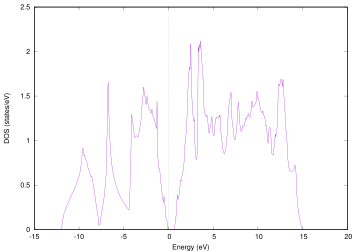

.. _si2_chapter:

シリコン結晶を用いた基本的な計算
================================

まずはもっとも簡単な例題として，2原子からなるシリコン結晶の計算を行います。最初に基本となるself-consistent field (SCF) 計算を実施します。この計算が終了すると電荷密度が得られるので，VESTAを利用して電荷密度を可視化する作業を行います。さらに，この計算によって得られた電荷密度を入力とし，状態密度・バンド構造・誘電関数の計算を実行し，結果の解析方法を学んでいただく予定です。

.. _si2_scf_section:

SCF計算
-------

すべての計算の基本となる，SCF計算の実行方法を説明します。この計算は，あらかじめ用意したサンプルデータをもとに実行していただきます。留意する必要のある入力パラメーターファイルの設定項目を説明したあとに計算を実行し，さらに結果として得られる電荷密度の可視化の方法を説明します。例題の入力ファイルは ``samples/Si2/scf`` 以下に配置されています。

入力データの確認
~~~~~~~~~~~~~~~~

nfinp.dataファイル
^^^^^^^^^^^^^^^^^^

nfinp.dataファイルは，PHASE/0の計算設定を行う「入力パラメーターファイル」です。この例題のnfinp.dataファイルの内容は下記の通り。

.. code-block:: text

  Control{
    condition = initial
  }
  accuracy{
    cutoff_wf = 20.0 rydberg
    cutoff_cd = 80.0 rydberg
    ksampling{
      mesh{ nx = 4, ny = 4, nz = 4 }
    }
  }
  structure{
    unit_cell_type = primitive
    unit_cell{
      a_vector = 0.00 5.13 5.13
      b_vector = 5.13 0.00 5.13
      c_vector = 5.13 5.13 0.00
    }
    symmetry{
      method = automatic
      tspace{
        lattice_system = facecentered
      }
    }
    atom_list{
      atoms{
      #tag rx ry rz element
        0.125 0.125 0.125 Si
       -0.125 -0.125 -0.125 Si
      }
    }
    element_list{ #tag element atomicnumber
      Si 14
    }
  }
  postprocessing{
    charge{
      sw_charge_rspace = on
      filetype = cube
    }
  }

PHASE/0の入力パラメーターファイルは，このように波カッコ{}で囲った“ブロック”とそこで設定される値から構成されます。以下のような設定が施されています。

- accuracyブロックにおいて計算精度に関わる設定が施されています。cutoff_wf, cutoff_cdにおいてそれぞれ波動関数および電荷密度のカットオフエネルギー，ksamplingブロックにおいて\ **k**\ 点サンプリングの設定が施されています。
- structureブロックにおいて原子配置が指定されています。

  - unit_cellブロックで単位胞を指定しています。
  - symmetryにおいて対称性が指定されています。method = automaticとすることによってプログラムが自動的に対称性を検出し，それを活用します。この際tspaceブロックのlattice_systemキーワードで結晶がfacecenteredであることを伝えています。
  - atom_listのatomsテーブルにおいて原子配置そのものを指定しています。
- postprocessingブロックのchargeブロックにおいてsw_charge_rspace = onとしています。こうすることによって実空間にマップした電荷密度をファイルに出力します。また，filetype = cubeとすることによってその形式をGaussian cube形式にしています。

file_names.dataファイル
^^^^^^^^^^^^^^^^^^^^^^^

「ファイル名を指定するためのファイル」がfile_names.dataファイルです。PHASE/0の入出力ファイルはこのファイルを通じてファイル名や場所を指定することができますが，このファイルのみ実行ディレクトリーにこの名前で存在する必要があります。この例題のfile_names.dataファイルの内容は下記の通り。

.. code-block:: text

  &fnames
  F_POT(1) = '../../pp/Si_ggapbe_paw_nc_01m.pp'
  F_CHR = './nfchr.cube'
  /

F_POT(1)によって1番目の元素の擬ポテンシャルファイルを指定しています。F_CHRによって実空間の電荷密度を出力するファイルを指定しています。このファイルのデフォルト値はnfchr.dataですが，Gaussian
cube形式で出力するので拡張子をcubeに変更しておいた方が便利です。

計算の実行
~~~~~~~~~~

実際に計算を実行してみましょう。計算は ``qsub`` コマンドによってジョブスクリプト(ファイル名run.sh)をシステムに投入することによって行います。ジョブスクリプトの内容は以下のようになっています。

.. code-block:: bash

  #!/bin/bash
  #PBS -q LECTUREC
  #PBS -l elapstim_req=00:10:00
  #PBS --group=G14671
  #PBS -l cpunum_job=76
  #PBS -y 2038

  module load BaseCPU
  cd ${PBS_O_WORKDIR}
  mpiexec -n 10 $HOME/phase0_2023.01/bin/phase ne=1 nk=10

この例では対称性によってk点は10点となるので，k点並列の並列数を10として計算を実行しました。並列の設定は問題や用いることのできるコア数などによって変わってきます。

``qsub`` コマンドによってジョブを投入します。

.. code-block:: bash

  qsub run.sh

ジョブの状態は ``qstat`` コマンドによって確認することができます。

計算結果の解析
~~~~~~~~~~~~~~

計算の結果，次のようなファイル群が出力ファイルとして得られます。

.. csv-table::
 :widths: 1,4

 "output000", "計算のログを記録するファイルです。SCF計算の各iterationにおけるエネルギーなどが記録されます。"
 "nfefn.data", "全エネルギーの計算結果が記録されるファイルです。構造最適化や分子動力学シミュレーションを実行している場合，エネルギーの履歴が記録されます。"
 "nfdynm.data", "座標データ履歴が記録されるファイルです。原子座標と原子間力が記録されます。"
 "nfchr.cube", "実空間の電荷密度データが記録されるファイルです。Gaussian cube形式で記録されます。VESTAなどのアプリケーションによって可視化することができます。"

そのほか，継続計算に必要なファイルなどが得られます。また，計算機能によってはほかにも様々な出力ファイルが得られる場合があります。output000ファイルからSCF計算の収束具合を調べてみましょう。

.. code-block:: text

  $ grep TH output000
  TOTAL ENERGY FOR  1 -TH ITER= -7.843775135159 EDEL = -0.784378D+01 : ...
  TOTAL ENERGY FOR  2 -TH ITER= -7.851142435464 EDEL = -0.736730D-02 : ...
  TOTAL ENERGY FOR  3 -TH ITER= -7.869822316521 EDEL = -0.186799D-01 : ...
  TOTAL ENERGY FOR  4 -TH ITER= -7.873273739596 EDEL = -0.345142D-02 : ...
  TOTAL ENERGY FOR  5 -TH ITER= -7.874467564388 EDEL = -0.119382D-02 : ...
  ...
  ...
  TOTAL ENERGY FOR 12 -TH ITER= -7.875384283153 EDEL = -0.446631D-08 : ...
  TOTAL ENERGY FOR 13 -TH ITER= -7.875384283383 EDEL = -0.230161D-09 : ...
  TOTAL ENERGY FOR 14 -TH ITER= -7.875384283401 EDEL = -0.179563D-10 : ...

TOTAL ENERGY FOR xx -TH ITER=の後の数値が全エネルギーの計算結果，EDEL = のあとの数値が1ステップ前と現ステップの全エネルギーの差です。この差が閾値（今の場合デフォルト値の1e-9 hartree/atom）よりも小さいステップがある回数（今の場合デフォルト値の2回）続くとSCF計算が収束したとみなされます。構造最適化などを行う場合はこのあと原子配置を更新し次のSCF計算へ移行しますが，今の場合は一点計算なのでこれで計算終了です。

VESTAを用いて電荷密度を可視化してみましょう。まずはnfchr.cube ファイルをローカルのパソコンに転送します。ついでVESTAを起動し，FileメニューからOpenを選びます。するとファイル選択ダイアログが得られるので，nfchr.cubeファイルを選択します。すると :numref:`si_iso_surface` で表示するような電荷密度の等値面が描画されます。等値面に採用する値や描画色などの設定は，Propertiesボタンをクリックすると得られる画面のIsosurfaceセクションを選ぶと得られるインターフェースから設定することができます（ :numref:`si_iso_surface_settings` ）。

  シリコン結晶の電荷密度の等値面

  等値面設定画面

バンド計算
----------

SCF計算で電荷密度が得られたので，これを入力として“バンド構造”を計算します。すなわち，電荷密度は正しいものとしてこれを固定し，第一ブリユアンゾーン内の対称線上の固有エネルギーの計算を行います。このような計算手法を“固定電荷計算”とよびます。例題の入力ファイルは ``samples/Si2/band`` 以下に配置されています。

.. _入力データの確認-1:

入力データの確認
~~~~~~~~~~~~~~~~

.. _nfinp.dataファイル-1:

nfinp.dataファイル
^^^^^^^^^^^^^^^^^^

バンド計算用の入力ファイルは以下のようなものとなります(SCF計算と共通する部分は省略)。

.. code-block::

  Control{
    condition = fixed_charge
  }
  accuracy{
    ...
    ksampling{
      method = file
    }
  }
  ...

-  controlブロックにおいてcondition = fixed_chargeとすることによって固定電荷計算を行う指示をしています。
-  accuracyのksamplingブロックにおいてmethod = fileとすることによって\ **k**\ 点生成方法をファイルからの読み込みとしています。

.. _file_names.dataファイル-1:

file_names.dataファイル
^^^^^^^^^^^^^^^^^^^^^^^

file_names.dataファイルは入出力ファイルのファイル名を指定するためのファイルです。このファイルにおいて，以下の要領でSCF計算の電荷密度ファイルの位置を指定します。

.. code-block::

  &fnames
  ...
  F_CHGT = '../scf/nfchgt.data'
  ...
  /

F_CHGTという識別子を用いて，1階層上のscfディレクトリーのnfchgt.dataファイルを指定しています。

kpoint.dataファイル
^^^^^^^^^^^^^^^^^^^

kpoint.dataファイルにバンド構造を計算したい対称線上の\ **k**\ 点の座標が記述されています。その内容は下記の通り。

.. code-block::

  141 141
  0 50 50 100 1
  0 49 49 100 1
  0 48 48 100 1
  ...
  ...

1行目の1カラム目に\ **k**\ 点の総数を指定します。2カラム目はこの例題では未使用のデータです。2行目以降が\ **k**\ 点の座標で，最初の3カラムがx, y, z座標，4カラム目が規格化のファクター，5カラム目が重みとなります。実際の\ **k**\ 点の座標はたとえば1から3カラム目の値を\ *k\ x\ k\ y\ k\ z* 4カラム目の値を\ *d*\ とすると\ *k\ x/d*, *k\ y/d*, *k\ z/d* となります。また，バンド計算の場合重みは常に1です。

特殊\ **k**\ 点の座標を入力とするとkpoint.dataファイルを作成してくれるPerlスクリプトがband_kpoint.plスクリプトです。その入力ファイルがbandkpt.inです。その内容は以下のようになります。

.. code-block::

  0.02
  -1.0 1.0 1.0
  1.0 -1.0 1.0
  1.0 1.0 -1.0
  0 1 1 2 # X
  0 0 0 1 # {/Symbol G}
  1 1 1 2 # L
  ...

1行目に対称線上の\ **k**\ 点の“間隔”を指定します。続く3行が逆格子の指定ですが，これは比があっていれば問題ありません。以降で対称線上の特殊\ **k**\ 点の値を指定します。この例ではまず(0 1/2 1/2)すなわちFCCのX点から始まり (0 0 0)すなわちΓ点に向かい，そこから(1/2 1/2 1/2)すなわちFCCのL点に向かい，...  という対称線の指定となります。各特殊\ **k**\ 点指定において#のあとに特殊\ **k**\ 点をあらわす記号を指定することができます。この情報は\ **k**\ 点生成には用いられませんが，後述するバンド図に反映させることができます。このようなファイルを入力とし，band_kpoint.plを以下の要領で実行するとkpoint.dataファイルを作成することができます。

.. parsed-literal::

  $ ~/|PHASE020XX.yy|/bin/band_kpoint.pl bandkpt.in
  Distance of 1 = 1
  Distance of 2 = 0.866025403784439
  Distance of 3 = 0.612372435695794
  Distance of 4 = 0.353553390593274
  division numbers = 50 43 30 17
  i=0 0 -0.01 -0.01
  i=1 0.0116279069767442 0.0116279069767442 0.0116279069767442
  i=2 0.00416666666666667 -0.00833333333333333 0.00416666666666667
  i=3 -0.00735294117647059 -0.0147058823529412 -0.00735294117647059
  1 : 0 0.5 0.5
  => 0/100 50/100 50/100
  ...

.. _計算の実行-1:

計算の実行
~~~~~~~~~~

固定電荷計算はekcalプログラムで行います。 ``run.sh`` の内容は下記の通り。

.. code-block:: bash

  #!/bin/bash
  #PBS -q LECTUREC
  #PBS -l elapstim_req=00:10:00
  #PBS --group=G14671
  #PBS -l cpunum_job=76
  #PBS -y 2038

  module load BaseCPU
  cd ${PBS_O_WORKDIR}
  mpiexec -n 72 $HOME/phase0_2023.01/bin/ekcal ne=1 nk=72

k点数が多いのでk点並列数も多くなっています。

.. _計算結果の解析-1:

計算結果の解析
~~~~~~~~~~~~~~

バンド計算の結果はnfenergy.dataファイルに記録されます。このファイルから“バンド図”を作成するためのPerlスクリプトがband.plです。以下の要領で実行します。

.. parsed-literal::

  ~/|PHASE020XX.yy|/bin/band.pl nfenergy.data bandkpt.in -color -with_fermi

band.plにはいくつかオプションがありますが，そのうち-color (カラーのバンド図を作成する)と -with_fermi (フェルミエネルギーの位置をあらわす線を描画する)を有効にしました。バンド図はband_structure.epsというEPS形式の画像ファイルとして得られます。これを表示するにはevinceコマンドを利用します。

.. code-block:: text

  evince band_structure.eps

以上の操作によって :numref:`si_band` で示すようなバンド構造図が描画されます。

  シリコン結晶のバンド構造図

状態密度計算
------------

バンド計算の場合と同様固定電荷計算を用いて状態密度の計算を行います。状態密度の計算はSCF計算収束後のポスト処理として行うことも可能ですが，SCF計算とは異なる\ **k**\ 点サンプリングやバンド数を用いて状態密度を求めたい場合は固定電荷計算によって計算することができます。この例題の入力ファイルは ``samples/Si2/dos`` 以下にあります。

.. _入力データの確認-2:

入力データの確認
~~~~~~~~~~~~~~~~

.. _nfinp.dataファイル-2:

nfinp.dataファイル
^^^^^^^^^^^^^^^^^^

状態密度計算用の入力ファイルは以下のようなものとなります(SCF計算・バンド構造計算と共通する部分は省略)。

.. code-block:: text

  accuracy{
    ksampling{
      method = mesh
      mesh{ nx = 8, ny = 8, nz = 8 }
    }
    smearing{
      method = tetrahedral
    }
  }
  postprocessing{
    dos{
      sw_dos = ON
      method = tetrahedral
    }
  }

-  accuracyブロックのksamplingブロックにおいてmethodをmeshとし，さらにsmearingブロックにおいてmethodをtetrahedralに設定しています。これらの設定は四面体法による状態密度計算を行うために必要なものです。van-Hove特異点を精度よく再現するために，\ **k**\ 点分割数もSCF計算よりも増やしています。
-  postprocessingブロックのdosブロックにおいてsw_dosをonとし，methodをtetrahedralとしています。

.. _計算の実行-2:

計算の実行
~~~~~~~~~~

固定電荷計算はバンド計算と同様ekcalプログラムで行います。

.. _計算結果の解析-2:

計算結果の解析
~~~~~~~~~~~~~~

状態密度の計算結果はdos.dataファイルに記録されます。その内容は下記のようになります。

.. code-block:: text

  No.   E(hr.)  dos(hr.)   E(eV)    dos(eV)   sum
      6 -0.3404 0.00000000 -12.1937 0.0000000000 0.0000
     16 -0.3400 0.00000000 -12.1837 0.0000000000 0.0000
  ...
  ...
  12176  0.1069 0.00891554  -0.0237 0.0003276399 8.0000
  12186  0.1072 0.00297770  -0.0137 0.0001094283 8.0000
  12196  0.1076 0.00029899  -0.0037 0.0000109877 8.0000
  12206  0.1080 0.00000000   0.0063 0.0000000000 8.0000
  12216  0.1083 0.00000000   0.0163 0.0000000000 8.0000
  ...
  ...

1行があるエネルギーにおける状態密度に対応します。1カラム目はエネルギーの識別番号，2カラム目および3カラム目がハートリー単位のエネルギーと対応する状態密度，4カラム目と5カラム目がeV単位のエネルギーと対応する状態密度，6カラム目が積算状態密度です。4カラム目はフェルミエネルギー（もしくは価電子帯の上端）が0となるようにシフトされています。4カラム目が0となる準位における積算状態密度は電子数と等しくなります。

dos.dataファイルから“状態密度図”を作成するPerlスクリプトがdos.plです。以下のように実行することができます。

.. parsed-literal::

  ~/|PHASE020XX.yy|/bin/dos.pl dos.data -color -with_fermi

dos.plにはいくつかオプションがありますが，そのうち-color (カラーのバンド図を作成する)と -with_fermi (フェルミエネルギーの位置をあらわす線を描画する)を有効にしました。状態密度図はdensity_of_states.epsというEPS形式の画像ファイルとして得られます。これを表示するにはevinceコマンドを利用します。

.. code-block:: text

  evince density_of_states.eps

以上の操作によって :numref:`si_dos` で示すような状態密度図が描画されます。

  シリコン結晶の状態密度図

誘電関数の計算
--------------

固定電荷計算を用いて誘電関数の計算を行います。誘電関数の計算は状態密度の計算と同様指定の\ **k**\ 点セットを用いて波動関数をときなおし，バンド間遷移の遷移確率を計算することによって計算します。この例題の入力は ``samples/Si2/eps`` 以下にあります。

.. _入力データの確認-3:

入力データの確認
~~~~~~~~~~~~~~~~

.. _nfinp.dataファイル-3:

nfinp.dataファイル
^^^^^^^^^^^^^^^^^^

固定電荷状態密度計算用の入力に似ていますが，epsilonブロックを作成し，そこで誘電関数計算の設定を行う点が異なります。

.. code-block:: text

  epsilon {
    sw_epsilon = on
    photon{
      polar{ux=1.00, uy=0.00, uz=0.00}
      energy{low=0.000, high=2.000, step=0.002}
    }
    fermi_energy{
      read_efermi = off
      efermi = 0.0000
    }
    transition_moment{
      type = ks
      symmetry = on
    }
    BZ_integration {
      method = t
    }
  }

-  sw_epsilon = onとすることによって誘電関数計算を有効にします。
-  photonブロックにおいて電磁波状態の情報を設定します。polorブロックで「直線偏光の分極ベクトル」を指定し，energyブロックで電磁波のエネルギー範囲を指定します。
-  transition_momentで遷移確率の計算方法を指定します。この例ではtype = ksとすることによってKageshima-Shiraishi(KS)型遷移モーメント補正を用いることを指定しています。またsymmetry = onとすることによって対称性を活用する指定を行っています。
-  BZ_integrationブロックにおいてブリユアンゾーン内でどのように積分を行うかを指定します。method = tとすると四面体法を利用するようになります。

.. _計算の実行-3:

計算の実行
~~~~~~~~~~

誘電関数計算はepsmainプログラムで行います。 ``run.sh`` ファイルの内容は下記の通り。

.. code-block:: bash

  #!/bin/bash
  #PBS -q LECTUREC
  #PBS -l elapstim_req=00:10:00
  #PBS --group=G14671
  #PBS -l cpunum_job=76
  #PBS -y 2038

  module load BaseCPU
  cd ${PBS_O_WORKDIR}
  mpiexec -n 19 $HOME/phase0_2023.01/bin/epsmain ne=1 nk=19

.. _計算結果の解析-3:

計算結果の解析
~~~~~~~~~~~~~~

誘電関数の計算結果はeps.dataファイルに記録されます。

.. code-block:: text

  Dielectric Function Optical Properties
  Photon Energy(eV) Real Part Imaginary Part n k abs(in 10**9 m-1) R
  0.00000 13.37808 0.00000 3.65761 0.00000 0.00000 0.32558
  0.05442 13.38035 0.00000 3.65792 0.00000 0.00000 0.32561
  ...
  ...

各行があるエネルギーの計算結果に対応します。各カラムは，それぞれ電磁波のエネルギー, 誘電関数(実部), 誘電関数(虚部), 屈折率(実部), 屈折率(虚部), 吸収係数, 反射スペクトルに対応します。バンド構造や状態密度計算のような作図用のスクリプトはありませんので，gnuplotを用いてグラフを作成してみます。たとえば以下のようなコマンドによって誘電関数の実部と虚部をエネルギーの関数としてプロットすることができます。

.. code-block:: text

  $ gnuplot
  ...
  ...
  Terminal type is now 'wxt'
  gnuplot> plot 'eps.data' using 1:2 with lines
  gnuplot> replot 'eps.data' using 1:3 with lines axis x1y2
  gnuplot> set y2tics
  gnuplot> replot
  gnuplot> set xrange [0:20]
  gnuplot> replot

\ :numref:`si_eps_plot` のような表示が得られるはずです。

  上述の手続きによって得られる誘電関数の実部と虚部のプロット。

振動解析
--------

PHASE/0には格子振動の基準モードを計算する機能が備わっています。振動解析は安定な結晶から原子位置をわずかにずらし，力計算を行うことによって行います。この際，ずらす対象の原子と方向は検出した対称性に応じてなるべく少なくなるように自動的に決まります。例題の入力ファイルは ``samples/Si2/phonon`` 以下に配置されています。

.. _入力データの確認-4:

入力データの確認
~~~~~~~~~~~~~~~~

.. _nfinp.dataファイル-4:

nfinp.dataファイル
^^^^^^^^^^^^^^^^^^

\ :ref:`si2_scf_section` の入力にPhononブロックを追加し，振動解析の設定を施します。また，通常のSCF計算と違い質量が重要な意味を持つので，元素の質量を正しく設定します。

.. code-block:: text

  structure{
    ...
    element_list{
      #units atomic_mass
      #tag element atomicnumber mass
      Si 14 28.0855
    }
  }
  Phonon{
    sw_phonon = on
    sw_calc_force = on
    sw_vibrational_modes = on
  }

-  element_listの下に#units atomic_massを記述することによってブロック内の質量の単位を原子質量単位に変更しています（デフォルトの質量の単位は原子単位；すなわち電子の質量を1とする単位）またmassカラムを追加することによって質量を指定できるようにしています。
-  Phononブロックにおいてsw_phonon, sw_calc_force, sw_vibrational_modesをonとします。このように設定すると振動解析は自動的に行われます。

.. _計算の実行-4:

計算の実行
~~~~~~~~~~

振動解析はphaseプログラムで行います。 \ :ref:`si2_scf_section` と違い，対称性に応じて原子を変位させながら原子間力の計算を行うので複数回のSCF計算を行います。この例では2回のSCF計算が実行されます。原子を変位させると対称性がそこなわれるためSCF計算1回あたりの計算時間も長くなる傾向になります。

.. _計算結果の解析-4:

計算結果の解析
~~~~~~~~~~~~~~

振動解析の計算結果はmode.dataファイルに記録されます。その内容は下記の通り。

.. code-block:: text

  --- primitive lattice vectors ---
  0.0000000000 5.1300000000 5.1300000000
  5.1300000000 0.0000000000 5.1300000000
  5.1300000000 5.1300000000 0.0000000000
  --- Equilibrium position and mass of each atom---
  Natom= 2
  1 1.2825000000 1.2825000000 1.2825000000 51196.42133 Si
  2 -1.2825000000 -1.2825000000 -1.2825000000 51196.42133 Si
  --- Vibrational modes ---
  Nmode= 6 Natom= 2
  n= 1 T1u IR
  hbarW= -0.00000000E+00 Ha = -0.00000000E+00 eV; nu= -0.00000000E+00 cm^-1
  1 0.0000000000 0.7071067812 0.0000000000
  2 0.0000000000 0.7071067812 0.0000000000
  ...
  ...
  n= 6 T2g R
  hbarW= 0.23347395E-02 Ha = 0.63531493E-01 eV; nu= 0.51241611E+03 cm^-1
  1 0.0000000000 0.0000000000 0.7071067812
  2 0.0000000000 0.0000000000 -0.7071067812

--- primitive lattice vectors ---以降の三行にセルベクトルが記録され，--- Equilibrium position and mass of each atom---に続く行に原子座標データが記録されます。--- Vibrational modes ---以降が振動解析の結果です。Nmode= 6はモードの数が6つであることを意味します。n= ...から各モードのデータが記録されます。hbarW= ...の行でそのモードの固有エネルギーが，続く行に固有ベクトルが記録されます。ただし最初の3つのモードは系全体が並進するモードに対応するため意味を成しません。

mode.dataファイルから振動モード図を作成するPerlスクリプトがfreq.plです。以下の要領で実行します。

.. parsed-literal::

  ~/|PHASE020XX.yy|/bin/freq.pl mode.data

結果得られる振動モード図は :numref:`si_freq` のようなものです。対称性に応じてモードを分類し，その振動数を表示します。

  振動モード図

この例題では有効なモードは1つしかないのであまり意味のある図ではありませんが，ある程度の振動モードの数が多い場合に振動モードを分かりやすく分類してくれるため有用な図となります。

*EV*\ 曲線
----------

複数の格子定数（単位胞体積）で計算を行い，マーナハンの状態方程式に結果をフィットすることによって安定な単位胞の体積，すなわち格子定数を得ることができます。マーナハンの状態方程式とは，以下に示すようなものです。

.. math:: E_{\text{tot}}\left( V \right) = \frac{\text{BV}}{B^{'}(B^{'} - 1)}\left\lbrack B^{'}\left( 1 - \frac{V_{0}}{V} \right) + \left( \frac{V_{0}}{V} \right)^{B^{'}} - 1 \right\rbrack + E_{\text{tot}}\left( V_{0} \right).

ここで\ :math:`E_{\text{tot}}\left( V \right),\ B,\ B^{'},\ V_{0}`\ はそれぞれ体積における全エネルギー，体積弾性率，体積弾性率の圧力微分，安定な体積に対応します。この表式から分かるように，この手続きによって格子定数だけでなく体積弾性率やその圧力微分を得ることもできます。この例題の入力ファイルは ``samples/Si2/ev`` 以下にあります。

.. _入力データの確認-5:

入力データの確認
~~~~~~~~~~~~~~~~

この計算においては格子定数を変化させながら逐次計算を実施していきます。このような計算を実施する場合，入力パラメーターファイルのテンプレートを用意し，シェルスクリプトによって実際に用いる入力パラメーターファイルを作成しながら計算を実行していくと効率よく計算を行うことができます。

入力パラメーターファイル（のテンプレート）
^^^^^^^^^^^^^^^^^^^^^^^^^^^^^^^^^^^^^^^^^^

この例題のために用意したテンプレート入力パラメーターファイルは下記の通り（\ :ref:`si2_scf_section` と共通の部分は省略）。

.. code-block:: text

  structure{
    unit_cell{
      a = __A__
      b = __A__
      c = __A__
      alpha = 90
      beta = 90
      gamma = 90
    }
  }

格子定数の指定が数値ではなく__A__という文字列になっています。この文字列は，シェルスクリプトによって実行時に格子定数の値に置き換わります。入力パラメーターファイルのほかの箇所と被らなければどのような文字列を採用しても問題ありません。

.. _file_names.dataファイル-2:

file_names.dataファイル
^^^^^^^^^^^^^^^^^^^^^^^

file_names.dataファイルの内容は下記のようになっています。

.. code-block:: text

  &fnames
  F_POT(1) = '../../../pp/Si_ggapbe_nc_01.pp'
  /

3階層上のディレクトリーの下のppというディレクトリーにある擬ポテンシャルファイルを指しています。ppディレクトリーはサンプルのディレクトリーの2階層上のディレクトリーですが，スクリプト実行時には子ディレクトリーを作成し，そこで計算が行われることを考慮した結果このような指定になっています。

シェルスクリプト
^^^^^^^^^^^^^^^^

利用するシェルスクリプト(cubic.sh)は以下のようなものです。なお，行頭の数値は説明用に付加したものであり，実際はありません。

.. code-block:: bash
  :linenos:

   #!/bin/sh
   #PBS -q LECTUREC
   #PBS -l elapstim_req=0:01:00
   #PBS --group=G14671
   #PBS -l cpunum_job=76

   module load BaseCPU
   cd ${PBS_O_WORKDIR}

   inivol=1000
   n=21
   dv=10
   np=2
   nk=2
   ne=1
   rm -f nfefn.data
   PHASE0="mpiexec -n ${np} $HOME/phase0_2023.01/bin/phase ne=${ne} nk=${nk}"
   for v in `seq 1 $n`;do
     vol=$( echo "($v-1)*$dv + $inivol" | bc -l )
     a=$( echo "e(l($vol)/3)" | bc -l )
     echo "volume : $vol"
     mkdir -p vol$vol
     cp file_names.data vol$vol
     sed "s/__A__/$a/g" nfinp.data > vol$vol/nfinp.data
     cd vol$vol
     ${PHASE0}
     cd ..
     echo -n $vol>> nfefn.data ; tail -1 vol$vol/nfefn.data >>nfefn.data
   done

-  10行目で1番目の体積の値，11行目で計算する体積の数，12行目で体積の刻み幅を指定しています。この例では，まず1000 bohr\ :sup:`3` からはじめ，10 bohr\ :sup:`3` きざみで体積を増やしていき，21回の計算を行うことで1200 bohr\ :sup:`3` まで体積を大きくして計算を行うことになります。
-  13行目はプロセス数，14行目はk点並列数，15行目はバンド並列数です。お使いの環境にあわせて編集してください。
-  17行目でPHASE/0を起動するコマンドを変数PHASE0に格納しています。
-  18行目からが実際の計算です。for文とseqコマンドを利用し1からnまでループを回しています。
-  19行目，20行目ではbcコマンドを利用して体積と対応する格子定数を計算しています。
-  22行目では計算に使うディレクトリーをmkdirコマンドによって作成しています。
-  23行目でfile_names.dataファイルを計算用ディレクトリーにコピーしています。
-  24行目では，sedコマンドによって先ほどのnfinp.dataファイル中の__A__という文字列を目的の格子定数に置き換え，計算用ディレクトリーの下のnfinp.dataというファイルに出力しています。
-  25行目で計算用ディレクトリーに移り，26行目で計算を実行しています。
-  27行目でもとのディレクトリーに移った後，28行目ではechoコマンドとtailコマンドを利用して結果をスクリプト実行ディレクトリーのnfefn.dataというファイルに積算しています。

このスクリプトは，10行目から15行目を編集することによって他の立方晶の結晶に適用することもできます。

.. _計算の実行-5:

計算の実行
~~~~~~~~~~

これまで同様， ``qsub`` コマンドを用いてジョブを投入してください。

結果の解析
~~~~~~~~~~

このスクリプトを実行すると得られるnfefn.dataファイルの中身は以下のようになっているはずです。

.. code-block:: text

  $ cat nfefn.data
  1000 1 11 -7.8711979339 0.0000000000
  1010 1 11 -7.8720573907 0.0000000000
  1020 1 11 -7.8728270483 0.0000000000
  1030 1 11 -7.8734755993 0.0000000000
  1040 1 12 -7.8740254367 0.0000000000
  1050 1 11 -7.8744947325 0.0000000000
  1060 1 11 -7.8748582628 0.0000000000
  1070 1 12 -7.8751568272 0.0000000000
  1080 1 12 -7.8753836059 0.0000000000
  1090 1 12 -7.8755212142 0.0000000000
  1100 1 12 -7.8755917399 0.0000000000
  1110 1 12 -7.8755984193 0.0000000000
  1120 1 12 -7.8755265291 0.0000000000
  1130 1 12 -7.8753913443 0.0000000000
  1140 1 12 -7.8751961234 0.0000000000
  1150 1 12 -7.8749652461 0.0000000000
  1160 1 12 -7.8746680963 0.0000000000
  1170 1 12 -7.8743133309 0.0000000000
  1180 1 12 -7.8739200962 0.0000000000
  1190 1 12 -7.8734554597 0.0000000000
  1200 1 12 -7.8729795665 0.0000000000

通常得られるnfefn.dataファイルの内容と似ていますが，1列目が原子単位の体積である点が異なります。

得られたnfefn.dataファイルとgnuplotを利用して，マーナハンの状態方程式にフィットしてみます。以下の操作を行ってください。

.. code-block:: text

  $ gnuplot
  ...
  gnuplot> f(x) = (a*x/(b*(b-1)))*(b*(1-c/x)+(c/x)**b-1)+d
  gnuplot> a=0.001
  gnuplot> b=2
  gnuplot> c=1100
  gnuplot> d=-7.8
  gnuplot> fit f(x) 'nfefn.data' using 1:4 via a,b,c,d
  ...
  ...
  Final set of parameters Asymptotic Standard Error
  ======================= ==========================
  a = 0.00073905 +/- 1.202e-06 (0.1626%)
  b = 4.22666 +/- 0.08447 (1.999%)
  c = 1104.94 +/- 0.09036 (0.008178%)
  d = -7.8756 +/- 2.387e-06 (3.031e-05%)
  correlation matrix of the fit parameters:
  a b c d
  a 1.000
  b -0.498 1.000
  c 0.273 -0.893 1.000
  d -0.744 0.287 -0.172 1.000

Final set of parametersに続くデータがフィッティングの結果です。この例では，aが体積弾性率，bが体積弾性率の圧力微分，cが単位胞の体積，dが安定な単位胞体積における全エネルギーに相当します。したがって，まず単位胞の体積は1104.94と求まったことが分かります。三乗根をとると，格子定数はおおよそ10.34 bohr (5.47 Å)となります。また，aは体積弾性率に相当しますが，少し注意が必要です。格子定数はブラベー格子のもので与えていますが，実際の計算は基本格子で行っています。面心立方格子では，ブラベー格子の体積は基本格子の体積の四倍なのでここで得られた体積弾性率の結果も四倍する必要があります。この点に留意すると，体積弾性率は原子単位で0.00073905×4 = 0.0029562, つまりおおよそ87 GPaとなります。得られる\ *EV*\ 曲線は，下図のようなものになります。

  本例題で得られる\ *EV*\ 曲線。

