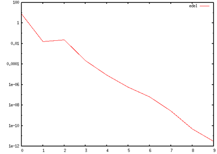
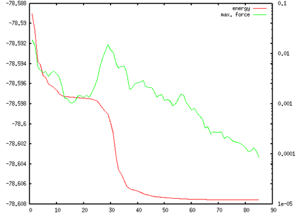

.. _sup_chapter:

付録
====

PHASE/0による計算のtips
-----------------------

計算に必要なファイル
~~~~~~~~~~~~~~~~~~~~

PHASE/0による計算を実行するには，以下のファイルが必要です。

-  file_names.dataファイル
-  nfinp.data ファイル（入力パラメーターファイル）
-  元素分の擬ポテンシャルファイル

入力パラメーターファイル
~~~~~~~~~~~~~~~~~~~~~~~~

入力パラメーターファイル（nfinp.dataファイル）は，計算対象の系や計算条件などの設定を行うファイルです。その内容は多岐にわたるので詳細な説明はしませんが，以下の設定は重要なのでサンプルの入力を確認する場合は留意してください。

-  accuracyブロック：カットオフエネルギー，\ *k*\ 点サンプリング手法，収束判定条件など，計算精度に関わる設定を行います。
-  structureブロック：原子配置や元素の定義を行います。
-  postprocessingブロック：計算が収束したあとに行う後処理の指定を行います（状態密度計算など）

入力パラメーターファイルの以下の点は間違えやすいので，注意が必要です。

-  単位の間違い。Å単位のつもりがbohr単位だった，など
-  “coordinate_system”の間違い。cartesianのつもりだったのがinternalだった，もしくはその逆。
-  元素の定義順の間違い。element_listブロックにおける元素の定義順は，file_names.dataにおける擬ポテンシャルファイルの定義順と同じである必要がある。

.. _計算の実行-11:

計算の実行
~~~~~~~~~~

並列計算は，nfinp.dataファイルやfile_names.dataファイルのあるディレクトリーに移り，mpiexecコマンドやmpirunコマンドを介して実行します。たとえば以下のようなコマンドになります。

.. parsed-literal::

   mpirun -n *NP* $HOME/|PHASE020XX.yy|/bin/phase ne=\ *NE* nk=\ *NK*

*NP*\ にはプロセス数（コア数），\ *NE*\ にはバンド並列数，\ *NK*\ にはk点並列数を指定します。\ *NP*\ はお使いの環境に合わせて入力し，\ *NP*
=
*NE*\ ×\ *NK*\ となるようバンド，k点の並列数を指定します。また，最後に&と入力して実行するとバックグラウンドで計算を実行することができます。

並列数を決める
~~~~~~~~~~~~~~

最適な並列数を決めるためのポイントはいくつかあります。

-  総並列数の上限は，利用している環境のコア数
-  総並列数を\ *N*\ とするとバンド並列数\ *N*\ :sub:`b`\ と\ *k*\ 点並列数\ *N\ k*\ との間には\ *N* = *N*\ :sub:`b`\ ×\ *N\ k*\ という関係が成立している必要がある
-  通常バンド並列数がバンド数を超えることはなく，あったとしてもPHASE/0は問題なく動作する
-  *k*\ 点数を超えた\ *k*\ 点並列数を指定すると異常終了する
-  多くの場合バンド並列よりも\ *k*\ 点並列の方が効率がよい
-  ただし\ *k*\ 点数が\ *k*\ 点並列数で割り切れないと効率が悪い

以上のことから，“事前に\ *k*\ 点数が分かっていれば効率の良い並列のさせ方が分かる”ということが分かります。\ *k*\ 点数は入力でのメッシュの指定の仕方や系の対称性などに依存するのでその数は自明ではありません。事前に調べるには，以下のような方法を利用することができます。

-  入力パラメーターファイルのcontrolブロックのconditionの値をpreparationとする
-  PHASE/0を非並列で実行する
-  | 計算はすぐに終了する。”kv3”という文字列をoutput000ファイルから検索する。kv3
     = のあとに続く数値がk点数（スピンを考慮した計算の場合，その半分）
   | $ grep kv3 output000
   | !kp kv3 = 10 nspin = 1
-  本計算を実行する前にconditionパラメーターの値を元に戻すのを忘れないように

SCF計算の収束具合を確かめる
~~~~~~~~~~~~~~~~~~~~~~~~~~~

SCF計算の収束具合を確認するには，以下の要領で文字列THをoutput000ファイルから検索し，全エネルギーや1ステップ前のエネルギーとの差を調べます。

.. code-block:: text

  $ grep TH output000
  TOTAL ENERGY FOR 1 -TH ITER= -7.837000950503 edel = -0.783700D+01 ...
  TOTAL ENERGY FOR 2 -TH ITER= -7.839515220565 edel = -0.251427D-02 ...
  TOTAL ENERGY FOR 3 -TH ITER= -7.839908027886 edel = -0.392807D-03 ...
  TOTAL ENERGY FOR 4 -TH ITER= -7.840075864037 edel = -0.167836D-03 ...
  TOTAL ENERGY FOR 5 -TH ITER= -7.840148564528 edel = -0.727005D-04 ...
  TOTAL ENERGY FOR 6 -TH ITER= -7.840207027180 edel = -0.584627D-04 ...
  TOTAL ENERGY FOR 7 -TH ITER= -7.840209759424 edel = -0.273224D-05 ...
  TOTAL ENERGY FOR 8 -TH ITER= -7.840209810085 edel = -0.506609D-07 ...
  TOTAL ENERGY FOR 9 -TH ITER= -7.840209813625 edel = -0.353987D-08 ...
  TOTAL ENERGY FOR 10 -TH ITER= -7.840209814325 edel = -0.699737D-09 ...
  TOTAL ENERGY FOR 11 -TH ITER= -7.840209814372 edel = -0.470983D-10 ...

TOTAL ENERGY FOR *N* -TH ITER= の後の数値が\ *N*\ 回目のSCF計算で得られているエネルギー，そのあとのedel=の後の数値が1ステップ前のエネルギーとの差です。なお，この数値は全セルのエネルギーですが，収束判定は原子1個あたりのエネルギーで行われるので注意が必要です。edelをプロットするためのgnuplotのコマンド例は下記の通りです。

.. code-block:: text

  $ grep TH output000>TH
  $ gnuplot
  gnuplot> set datafile fortran
  gnuplot> plot ’TH’ using (abs($10)) with lines title ’edel’
  gnuplot> set log y
  gnuplot> replot

  SCF iteration回数とedelの関係

計算のログファイルを監視する
~~~~~~~~~~~~~~~~~~~~~~~~~~~~

計算のログファイル(output000ファイル)は計算の進行があるたびにその内容が更新されます。その様子を監視するには，tail -fコマンドが便利です。

.. code-block:: text

  $ tail -f output000
  ...
  ...

なお，計算が終了するとなぜ終了したかが表示され，以降更新されなくなります。

構造最適化の履歴
~~~~~~~~~~~~~~~~

構造最適化の履歴は，nfefn.dataファイルとnfdynm.dataファイルに記録されます。nfefn.dataファイルの中身は，以下のようなものです。

.. code-block::

  $ less nfefn.data
  iter_ion, iter_total, etotal, forcmx
  1 21 -78.5809455694 0.0172429910
  2 33 -78.5823489899 0.0145375571
  3 51 -78.5856703762 0.0061089674
  4 58 -78.5860239085 0.0051604695
  5 70 -78.5872784872 0.0046626573
  6 79 -78.5874820406 0.0045542295
  ....
  ....

1列目は原子配置の更新回数，2列目はSCF計算の総回数，3列目は全エネルギー，4列目は原子間力の最大値です。4列目の数値が閾値 (デフォルト値は1e-3) を下回ると収束したとみなされ構造最適化計算は終了します。

nfefn.dataファイルの内容は単純なので，プロットツールなどを利用してその内容を簡単にプロットすることができます。以下はgnuplotのコマンド例です。

.. code-block:: text

  $ gnuplot
  gnuplot> plot ‘nfefn.data’ using 1:3 with lines title ‘energy’
  gnuplot> replot ‘nfefn.data’ using 1:4 with lines axis x1y2 title ‘max. force’
  gnuplot> set log y2
  gnuplot> set y2tics
  gnuplot> replot

  構造最適化のステップ数とエネルギーおよび原子間力最大値の関係のプロット

nfdynm.dataファイルには座標データの履歴が記録されます。付属の変換スクリプトconv.py( :numref:`sup_section_convpy` )を利用して様々な系式に変換することができます。conv.pyは対話的に利用することができるので，実行し，指示に従い入力していけば座標データファイルの変換を行うことができます。

SCF計算がなかなか収束しない場合の対処
~~~~~~~~~~~~~~~~~~~~~~~~~~~~~~~~~~~~~

-  | ミクシング比を小さくする
   | charge_mixing{
   | rmx = 0.1 ! デフォルト値はスピンを考慮しない場合0.4, する場合0.1
   | }
-  | バンド数を増やす（SCF計算の場合）
   | accuracy{
   | num_bands = ...
   | }
-  | “num_extra_bands”を増やす（固定電荷計算の場合）
   | accuracy{
   | ek_convergence{
   | num_extra_bands = 20 ! デフォルト値は2
   | }
   | }
-  | RMMに切り替えるタイミングを厳しくする（もしくは無効にする）
   | wavefunction_solver{
   | rmm{
   | edelta_change_to_rmm = 0 ! default : 1e-3 hartree/atm
   | }
   | }

単位
~~~~

PHASE/0においては，原則としてハートリー原子単位系が用いられます。ハートリー原子単位系は電子状態計算の理論の記述には便利ですが，それ以外の用途ではあまり利用されないため変換が必要な場合が多いです。ハートリー原子単位系と別の単位系との変換係数をいくつか記述します。

+------------+--------------------------------------------------------+
| エネルギー | 1 hartree = 2 rydberg = 27.21139615 eV = 4.359745836   |
|            | :math:`\times 10^{- 18}` J                             |
+------------+--------------------------------------------------------+
| 長さ       | 1 bohr = 0.5291772480 Å= 0.5291772480                  |
|            | :math:`\times 10^{- 10}`\ m                            |
+------------+--------------------------------------------------------+
| 質量       | 1 au mass = 電子の質量 =                               |
|            | 9.1094\ :math:`\times 10^{- 31}` kg                    |
+------------+--------------------------------------------------------+
| 力         | 1 hartree/bohr = 51.42208259 eV/Å= 8.238725025         |
|            | :math:`\times 10^{- 8}` N                              |
+------------+--------------------------------------------------------+
| 時間       | 1 au time = 2.418884327 :math:`\times 10^{- 2}` fs =   |
|            | 2.418884327 :math:`\times 10^{- 17}` s                 |
+------------+--------------------------------------------------------+
| ストレス   | 1 au stress = 2.903628623 :math:`\times 10^{9}` atm =  |
|            | 2.942101703 :math:`\times 10^{13}` Pa                  |
+------------+--------------------------------------------------------+

.. _sup_section_convpy:

座標データ変換
--------------

PHASE/0は独自の形式(F_DYNM形式)で原子座標の履歴などを出力します。これをVESTAなどの一般的な原子配置可視化ソフトで可視化するためには，CIF形式などの形式に座標を変換する必要があります。その変換のためのPythonスクリプトconv.pyはPHASE/0インストールディレクトリーの下のbinディレクトリーに含まれています。

conv.pyは対話的に利用します。たとえば，nfdynm.dataファイルをCIFに変換する手続きは下記の通りです。

+----------------------------------+----------------------------------+
| 画面に現れる文字列               | 説明                             |
+==================================+==================================+
| $ conv.py                        |                                  |
+----------------------------------+----------------------------------+
| atomic configuration converter   | 変換元のファイル形式\            |
|                                  |                                  |
| utility.                         | を指定する。nfdynm.dataの場合ph\ |
|                                  |                                  |
|                                  | ase_outputなので1を指定し，Enter |
| Copyright (C) the RISS project,  |                                  |
| The University of Tokyo          |                                  |
|                                  |                                  |
| select the type of the input     |                                  |
| atomic coordinate file           |                                  |
|                                  |                                  |
| 0. phase_input                   |                                  |
| 1. phase_output                  |                                  |
| 2. VASP_input                    |                                  |
| 3. VASP_output                   |                                  |
| 4. OpenMX_input                  |                                  |
| 5. OpenMX_output                 |                                  |
| 6. XSF                           |                                  |
| 7. xyz                           |                                  |
| 8. cube                          |                                  |
| 9. cif                           |                                  |
| 10. dmol                         |                                  |
| 11. LAMMPS_output                |                                  |
|                                  |                                  |
| x. Exit                          |                                  |
|                                  |                                  |
| Please enter a selection         |                                  |
| (0/1/2/3/4/5/6/7/8/9/10/11/x)    |                                  |
| [0]:                             |                                  |
+----------------------------------+----------------------------------+
| Please enter the name of the     | nfdynm.data                      |
|                                  |                                  |
| input atomic coordinate file, or | ファイルのファイル名を指定。nf\  |
|                                  |                                  |
| type x to exit. [nfdynm.data]:   | dynm.dataでよいならそのままEnter |
+----------------------------------+----------------------------------+
| Please enter the frame no.       | フレームを\                      |
|                                  |                                  |
| (enter a negative value in order | 選択する。負の値の場合「全フレー\|
|                                  |                                  |
| to output all frames when        | ム」を選択することに相当する。ま\|
|                                  |                                  |
| possible), or type x to exit.    | た，カンマ区切りで三つの整数を指\|
|                                  |                                  |
| [-1]:                            | 定することによって，             |
|                                  |                                  |
|                                  | 始フレーム, 終フレーム，間隔を\  |
|                                  |                                  |
|                                  | 指定することができる。この指定方\|
|                                  |                                  |
|                                  | 法の場合負の値は最終フレームを意\|
|                                  |                                  |
|                                  | 味する。フレームの数値は0始まり  |
+----------------------------------+----------------------------------+
| select the type of the output    | 変換先の形式を指\                |
|                                  |                                  |
| atomic coordinate file           | 定する。CIFの場合7と入力しEnter  |
|                                  |                                  |
| 0. phase_input                   |                                  |
| 1. phase_output                  |                                  |
| 2. VASP_input                    |                                  |
| 3. OpenMX_input                  |                                  |
| 4. XSF                           |                                  |
| 5. xyz                           |                                  |
| 6. cube                          |                                  |
| 7. cif                           |                                  |
| 8. dmol                          |                                  |
| 9. LAMMPS_input                  |                                  |
|                                  |                                  |
| x. Exit                          |                                  |
|                                  |                                  |
| Please enter a selection         |                                  |
| (0/1/2/3/4/5/6/7/8/9/x) [1]:     |                                  |
+----------------------------------+----------------------------------+
| Please enter the name the output | 出力ファイル名を指定する。CI\    |
|                                  |                                  |
| atomic coordinate file, or type  | Fの場合，デフォルト値はcoord.cif |
|                                  |                                  |
| x to exit. [coord.cif]:          |                                  |
+----------------------------------+----------------------------------+

以上の操作によって，nfdynm.dataファイルからCIFを得ることができます。そのほかのファイル形式についても同様に変換することができます。

conv.py起動時に，以下のオプションを指定することができます。

========== ===================================================
オプション 説明
========== ===================================================
--pack     単位胞の中に原子を押し込めます
--na=NA    *a*\ 軸をNA倍にしたスーパーセルを作成し，変換します
--nb=NB    *b*\ 軸をNB倍にしたスーパーセルを作成し，変換します
--nc=NC    *c*\ 軸をNC倍にしたスーパーセルを作成し，変換します
========== ===================================================

Linuxコマンド
-------------

+----------------------+----------------------------------------------+
| コマンド             | 説明                                         |
+======================+==============================================+
| cd                   | 引\                                          |
|                      | 数で指定したディレクトリーを変更する。引数な\|
|                      |                                              |
|                      | しで実行すると，ホームディレクトリーに移る。 |
|                      |                                              |
|                      | .  はカレントディレクトリー，                |
|                      |                                              |
|                      | .. は親ディレクトリ－，                      |
|                      |                                              |
|                      | ~  はホームディレクトリー，                  |
|                      |                                              |
|                      | /  はルートディレクトリーを表します。        |
|                      |                                              |
|                      | 例：                                         |
|                      |                                              |
|                      | cd abc (abcというディレクトリーに移る)       |
|                      |                                              |
|                      | cd (ホームディレクトリーに移る)              |
|                      |                                              |
+----------------------+----------------------------------------------+
| ls                   | ディレクトリーの下のファイルを表示する。\    |
|                      |                                              |
|                      | 例：                                         |
|                      |                                              |
|                      | $ ls                                         |
|                      |                                              |
|                      | nfinp.data file_names.data                   |
+----------------------+----------------------------------------------+
| less                 | ファイルの中身を参照する（編集は不可）       |
|                      |                                              |
|                      | 例：nfinp.dataファイルの中身を参照する       |
|                      |                                              |
|                      | $ less nfinp.data                            |
|                      |                                              |
|                      | control{                                     |
|                      |                                              |
|                      | condition = initial                          |
|                      |                                              |
|                      | }                                            |
|                      |                                              |
|                      | accuracy{                                    |
|                      |                                              |
|                      | ...                                          |
|                      |                                              |
|                      | ...                                          |
|                      |                                              |
|                      | jで下に，kで上\                              |
|                      | にスクロールできる。qで抜けることができる。  |
+----------------------+----------------------------------------------+
| pwd                  | 現在のディレクトリーを出力する。             |
|                      |                                              |
|                      | 例：                                         |
|                      |                                              |
|                      | $ pwd                                        |
|                      |                                              |
|                      | /home/phase0                                 |
+----------------------+----------------------------------------------+
| cp                   | 一つ目の引数のファ\                          |
|                      | イルを，二つ目の引数のファイルにコピーする。 |
|                      |                                              |
|                      | コピー先がディレクトリーの場合はそのディレク\|
|                      | トリーの下に\                                |
|                      |                                              |
|                      | コピー元と同じファイル名でコピーされる。\    |
|                      |                                              |
|                      | -Rオプションによってディレクトリーごと\      |
|                      |                                              |
|                      | コピーすることもできる。コピー先のファイル\  |
|                      |                                              |
|                      | が存在する場合上書きされるので，注意が必要。 |
+----------------------+----------------------------------------------+
| mv                   | 一つ目の引数のファ\                          |
|                      | イルを二つ目の引数のファイルにリネームする。 |
|                      |                                              |
|                      | 元のファイルは保持されないので注意が必要。   |
+----------------------+----------------------------------------------+
| rm                   | 引数に指定したファ\                          |
|                      | イルを削除する。やり直せないので注意が必要。 |
+----------------------+----------------------------------------------+
| echo                 | 引数の文字列をそのまま標準出力に出力する。   |
|                      |                                              |
|                      | 例：                                         |
|                      |                                              |
|                      | echo “abc”                                   |
|                      |                                              |
|                      | abc                                          |
+----------------------+----------------------------------------------+
| command > file       | コマンドの結果を，\                          |
|                      | ファイルに出力する。ファイルは上書きされる。 |
|                      |                                              |
|                      | 例：lsの結果をls.txtに出力する               |
|                      |                                              |
|                      | $ ls > ls.txt                                |
|                      |                                              |
|                      | $ less ls.txt                                |
|                      |                                              |
|                      | nfinp.data file_names.data                   |
+----------------------+----------------------------------------------+
| command >> file      | コマンドの結果を，ファイルの末尾に出力する。 |
+----------------------+----------------------------------------------+
| command1 \| command2 | command1の結果を，command2の入力とする。     |
|                      |                                              |
|                      | 例：実行中のmpiexecコマンドを調べる          |
|                      |                                              |
|                      | $ ps aux \|grep mpiexec                      |
|                      |                                              |
|                      | ... mpiexec -n 4 phase ...                   |
|                      |                                              |
|                      | ... grep mpiexec ...                         |
+----------------------+----------------------------------------------+
| tail                 | ファイルの末尾を表示する。\                  |
|                      |                                              |
|                      | -fオプションをつけるとファイル更新を監視する\|
|                      |                                              |
|                      | ようになり，更新される度にその内容が\        |
|                      |                                              |
|                      | 表示される。-*n*\ オプション(*n*\ は\        |
|                      |                                              |
|                      | 数値)を指定すると，末尾\ *n*\ 行を出力する。 |
+----------------------+----------------------------------------------+
| grep                 | ファイルの中身を検査し\                      |
|                      | ，引数に与えた文字列と一致する行を出力する。 |
|                      |                                              |
|                      | 例：output000からエネルギーの履歴を抽出する  |
|                      |                                              |
|                      | $ grep TH output000                          |
|                      |                                              |
|                      | TOTAL ENERGY FOR 1 -TH ITER=                 |
|                      | -198.325431056805 ...                        |
|                      |                                              |
|                      | TOTAL ENERGY FOR 2 -TH ITER=                 |
|                      | -198.341016261819 ...                        |
|                      |                                              |
|                      | TOTAL ENERGY FOR 3 -TH ITER=                 |
|                      | -198.379630813150 ...                        |
|                      |                                              |
|                      | ...                                          |
|                      |                                              |
|                      | ...                                          |
+----------------------+----------------------------------------------+
| mpiexec              | MPIジョブを開始する。                        |
|                      |                                              |
|                      | 例：4プロセ\                                 |
|                      | ス，バンド・k点2並列ずつでPHASE/0を実行する  |
|                      |                                              |
|                      | mpiexec -np 4 ~/|PHASE020XX.yy|/bin/phase    |
|                      | ne=2 nk=2                                    |
+----------------------+----------------------------------------------+
| gedit                | geditエディターを起動する。                  |
|                      |                                              |
|                      | 例：nfinp.dataを編集する。                   |
|                      |                                              |
|                      | $ gedit nfinp.data                           |
+----------------------+----------------------------------------------+
| sed                  | 引数で与えるファイルの内容を指定のルールに\  |
|                      |                                              |
|                      | 従って編集し，その結果を標準出力に出力する。 |
|                      |                                              |
|                      | 例：fileというファイ\                        |
|                      | ルにあるabcという文字列をすべてdefに置換する |
|                      |                                              |
|                      | $ less file                                  |
|                      |                                              |
|                      | abcdefghijklmnop                             |
|                      |                                              |
|                      | $ sed "s/abc/def/g" file                     |
|                      |                                              |
|                      | defdefghijklmnop                             |
+----------------------+----------------------------------------------+
| seq                  | 連続した数値を出力する。                     |
|                      |                                              |
|                      | 例：1から10を出力する                        |
|                      |                                              |
|                      | $ seq 1 10                                   |
|                      |                                              |
|                      | 1                                            |
|                      |                                              |
|                      | 2                                            |
|                      |                                              |
|                      | 3                                            |
|                      |                                              |
|                      | 4                                            |
|                      |                                              |
|                      | 5                                            |
|                      |                                              |
|                      | 6                                            |
|                      |                                              |
|                      | 7                                            |
|                      |                                              |
|                      | 8                                            |
|                      |                                              |
|                      | 9                                            |
|                      |                                              |
|                      | 10                                           |
+----------------------+----------------------------------------------+
| bc                   | 標\                                          |
|                      | 準入力から得た数式を評価し，結果を出力する。 |
|                      |                                              |
|                      | 例：(1+2)×3 を計算する                       |
|                      |                                              |
|                      | $ echo "(1+2)*3" \| bc –l                    |
|                      |                                              |
|                      | 9                                            |
+----------------------+----------------------------------------------+
| pushd/popd           | pushdコマンドによってcdコマンドと同様引数に\ |
|                      |                                              |
|                      | 指定したディレクトリーに移ることができる。\  |
|                      |                                              |
|                      | その後popdコマンドを実行するとpushdコマンド\ |
|                      |                                              |
|                      | を発行したディレクトリーに移ることができる。 |
+----------------------+----------------------------------------------+

