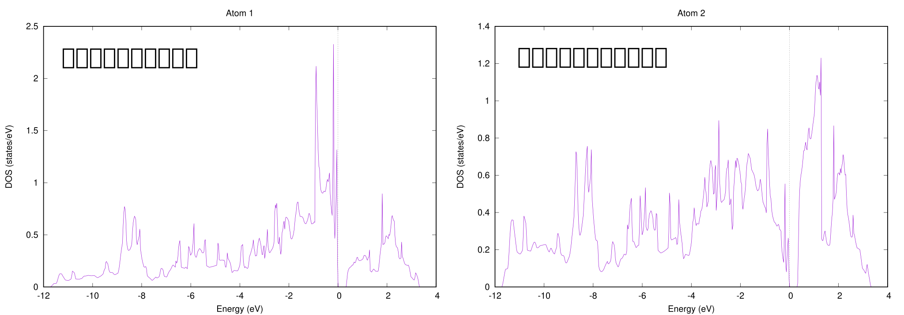
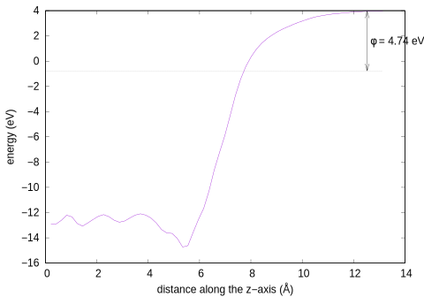

.. _surf_chapter:

表面の計算
==========

PHASE/0は平面波基底を利用するので扱うことが可能なのは周期的な系に限られますが，ある程度の大きさの“真空層”を設けることによって事実上表面と変わらない系を扱うことが可能です。この例題では，Si(100)表面の計算を行います。例題の入力ファイルは ``wsl/Si001`` 以下に配置されています。

.. _surf_relax_section:

構造最適化
----------

本例題の表面は次の図で示すようなものです。なお，この系は原点を中心とした反転対称性があるように設定されており，この図では反転対称性から等価な位置の原子は描画されていません。すなわち，実際に計算で扱う系は描画された原子の反転対称位置にも原子が配置されている系です。まずはこの構造の最適化を行います。例題の入力ファイルは ``wsl/Si001/relax`` の下にあります。

  Si(100)面。反転対称位置の原子は描画されていない。

.. _入力データの確認-7:

入力データの確認
~~~~~~~~~~~~~~~~

本例題の入力ファイルの主要部分は下記の通り。

.. code-block::

  ...
  accuracy{
    ksampling{
      mesh{
        nx = 2
        ny = 4
        nz = 1
      }
    }
    force_convergence{
      max_force = 2e-4
    }
    ...
  }
  structure{
    symmetry{
      method = automatic
      sw_inversion = on
    }
    atom_list{
      atoms{
        #tag element rx ry rz weight mobile
        Si 0.315656104534 0.75 0.237152295345 2 on
        Si 0.598029122106 0.75 0.209636130373 2 on
        Si 0.26602495266 0.25 0.185466403501 2 on
        Si 0.73854288575 0.25 0.182492535522 2 on
        Si 0.00536283827178 0.25 0.136873588205 2 on
        Si 0.492058345921 0.25 0.12432672152 2 on
        Si 0.00251446092889 0.75 0.0840435403934 2 on
        Si 0.501404226089 0.75 0.0727860480334 2 on
        Si 0.238553794997 0.75 0.0258423559513 2 off
        Si 0.765555448939 0.75 0.0267457921579 2 off
      }
    }
    unit_cell{
      #units bohr
      a_vector = 14.512 0.0 0.0
      b_vector = 0.0 7.25600000002 0.0
      c_vector = 0.0 0.0 49.6812599214
    }
    ...
    ...
  }

以下の点が特徴的です。

-  accuracyのforce_covergenceブロックにおいて構造最適化の収束判定条件が設定されています(max_force = 2e-4 ; 単位はデフォルト値のhartree/bohr)。ここで指定した値よりも最大原子間力が小さい場合に収束したとみなされます。
-  原子配置の指定にweight属性を利用しています。この属性値の値が2の場合，原点からみて反転対称の位置に同じ原子が配置されます。
-  *c*\ 軸の長さが50 bohr(26.5Å程度) 近くとなっています。この設定によって13から14Å程度の真空層を確保しています。
-  *c*\ 軸方向の\ *k*\ 点サンプリングメッシュが1となっています。表面モデルの場合通常表面に垂直な方向の\ *k*\ 点メッシュは1とします。違う言い方をすると，1としてよい（表面に垂直な方向の分散は無視できる）程度には厚い真空層を設ける必要があります。
-  原子配置の指定にmobile属性を利用しています。この例では，最下層の原子のmobileをoffとすることによって構造最適化の対象から外しています。
-  symmetryブロックにおいて，method = automaticだけでなくsw_inversion = onを利用しています。sw_inversionは系に反転対称性がある場合のみ利用できます。

.. _計算の実行-7:

計算の実行
~~~~~~~~~~

これまでと同じ手続きで計算を実行することができます。

.. parsed-literal::

  mpirun -n 2 $HOME/|PHASE020XX.yy|/bin/phase ne=1 nk=2

この例題の\ **k**\ 点数は2なので，多くのコアを搭載したマシンでも\ **k**\ 点並列数は2以下とする必要があります。

これまでと違い，“構造最適化”が行われるのでSCF計算が収束すると原子配置が計算された原子間力に応じて更新され，次のSCF計算に移行します。構造最適化計算の進行はnfefn.dataファイルの内容をみることによって確認することができます。

.. code-block::

  $ less nfefn.data

  iter_ion, iter_total, etotal, forcmx
  1 27 -78.6015420181 0.0074909920
  2 34 -78.6020126027 0.0067584284
  3 45 -78.6028324863 0.0060223336
  4 52 -78.6030036762 0.0045697291
  5 59 -78.6033506302 0.0037802003
  ...

1行が構造最適化のあるステップの結果に対応します。1カラム目が構造最適化のステップ番号，2カラム目がSCF計算の総繰り返し回数，3カラム目が全エネルギー，4カラム目が原子間力の最大値です。4カラム目の数値が収束判定条件よりも小さな値になると収束したとみなされ計算が終了します。

.. _結果の解析-2:

結果の解析
~~~~~~~~~~

上述のようにnfefn.dataファイルにステップごとのエネルギーや原子間力が記録されるので，このファイルの中身を確認することによってどのように収束していったかを調べることができます。以下のようにgnuplotを用いて履歴のグラフを作成することもできます。

.. code-block::

  $ gnuplot
  ...
  Terminal type is now 'wxt'
  gnuplot> plot 'nfefn.data'using 1:3 with lines title 'energy'
  gnuplot> replot 'nfefn.data'using 1:4 with lines axis x1y2 title 'max.  force
  gnuplot> set y2tic
  gnuplot> replot

上述の操作の結果 :numref:`si_surface_nfefn_plot` のようなプロットが得られます。

  エネルギーと原子間力の最大値の履歴

原子座標データはnfdynm.dataファイルに記録されます。このファイルをVESTAでそのまま可視化することはできないので，CIFなどのより一般的な形式に変換します。PHASE/0にはconv.pyという座標データを変換するツールが備わっているので( :ref:`sup_section_convpy` )，これを用いてnfdynm.dataファイルをCIFに変換します。結果得られたCIFをVESTAで読み込むことによって構造最適化の座標履歴を確認することができます。

局所状態密度計算
----------------

\ :ref:`surf_relax_section` によって得られた安定な表面構造を入力とし，局所状態密度の計算を行います。

.. _入力データの確認-8:

入力データの確認
~~~~~~~~~~~~~~~~

.. _nfinp.dataファイル-5:

nfinp.dataファイル
^^^^^^^^^^^^^^^^^^

nfinp.dataファイルの内容は以下の通り（構造最適化計算と同じである部分は省略）

.. code-block::

  accuracy{
    ksampling{
      method = mesh
      mesh{
        nx = 4
        ny = 8
        nz = 1
      }
    }
    smearing{
      method = tetrahedral
    }
    ...
  }
  structure{
    method = file
    file{
      filetype = phase0_output
    }
    atom_list{
      atoms{
        #tag element rx ry rz weight
        Si 0.315656104534 0.75 0.237152295345 2
        ...
        Si 0.765555448939 0.75 0.0267457921579 2
      }
    }
  }
  postprocessing{
    workfunc{
      sw_workfunc = on
    }
    dos{
      sw_dos = on
    }
    ldos{
      sw_aldos = on
    }
  }

-  状態密度を四面体法で，かつ構造最適化よりも濃い密度の\ **k**\ 点メッシュで計算する設定が施されています。すなわちksamplingのmethodはmesh, smearingのmethodはtetrahedral, **k**\ 点メッシュは4×8×1となっています。
-  構造最適化計算の最後の結果を用いるため，structureブロックにおいてmethod = fileを指定しています。さらにfileブロックにおいてfiletypeをphase0_outputとしています。このように設定するとnfdynm.dataファイルの最後のコマを入力座標として読み込みます。このような場合でも原子の属性値の定義を行うためにatom_listブロックのatomsテーブル自体は必要です。
-  postprocessingブロックで状態密度計算，原子分割局所状態密度計算，仕事関数計算の設定が施されています。

.. _file_names.dataファイル-3:

file_names.dataファイル
^^^^^^^^^^^^^^^^^^^^^^^

file_names.dataファイルの内容は以下のようになっています。

.. code-block::

  &fnames
  F_POT(1) = '../../pp/Si_ggapbe_nc_01.pp'
  F_POS = '../relax/nfdynm.data'
  /

F_POSによって構造最適化計算で得たnfdynm.dataファイルを指しています。

.. _計算の実行-8:

計算の実行
~~~~~~~~~~

これまでと同じ手続きで計算を実行することができます。

.. parsed-literal::

  mpirun -n 2 $HOME/|PHASE020XX.yy|/bin/phase ne=1 nk=2

この例題の\ **k**\ 点数は4なので，多くのコアを搭載したマシンでも\ **k**\ 点並列数は4以下とする必要があります。

.. _結果の解析-3:

結果の解析
~~~~~~~~~~

原子分割局所状態密度の結果はdos.dataファイルに全状態密度のあとに記録されます。dos.plスクリプトを用いることによって各原子に割り当てられた状態密度を得ることができます。

.. parsed-literal::

  $ $HOME/|PHASE020XX.yy|/dos.pl dos.data -mode=atom -color -with_fermi

この操作の結果dos_a001.eps, dos_a002.eps, ....といったEPSファイルが得られます。参考のため，得られる結果の一部の図を紹介します。

1番目の原子と2番目の原子の局所状態密度(dos_a001.epsおよびdos_a002.eps)

  局所状態密度

workfuncプログラムを使用することによって仕事関数を得ることができます。まずはworkfuncプログラムをコンパイルしましょう。

.. parsed-literal::
   pushd $HOME/|PHASE020XX.yy|/src_workfunc
   make F90=ifort
   make install
   popd

作業中のディレクトリーにすぐに戻ってこられるよう ``pushd`` ``popd`` コマンドを使ってみました。この例ではworkfuncプログラムをコンパイルする際に ``F90=ifort`` としてIntel Fortranコンパイラーを利用するようにしています。デフォルトで用いられるコンパイラーはgfortranですが，gfortranのバージョン10以上を用いる場合はオプションに ``-fallow-argument-mismatch`` を加える必要があります。そこで，gfortran 10以上を用いる場合は ``make`` コマンドに ``F90='gfortran -fallow-argument-mismatch'`` を渡すようにしてください。

workfuncプログラムを実行すると得られるnfvlcr_av.dataファイルから真空域のポテンシャルを見出します。その値とフェルミエネルギーの差が仕事関数に対応します。もしくは，workfunc.plスクリプトを利用します。

.. parsed-literal::

  $HOME/|PHASE020XX.yy|/bin/workfunc
  $HOME/|PHASE020XX.yy|/bin/workfunc.pl nfvlcr_av.data

\ :numref:`si_surface_workfunc` はworkfunc.plスクリプトによって得られたポテンシャルと\ *c*\ 軸方向の距離の関係です。真空域でのポテンシャルの値とフェルミエネルギーとの差が仕事関数に対応します。

  ポテンシャルと\ *c*\ 軸方向の距離の関係

